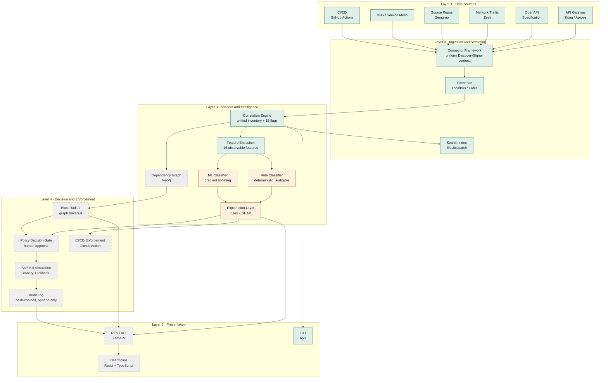
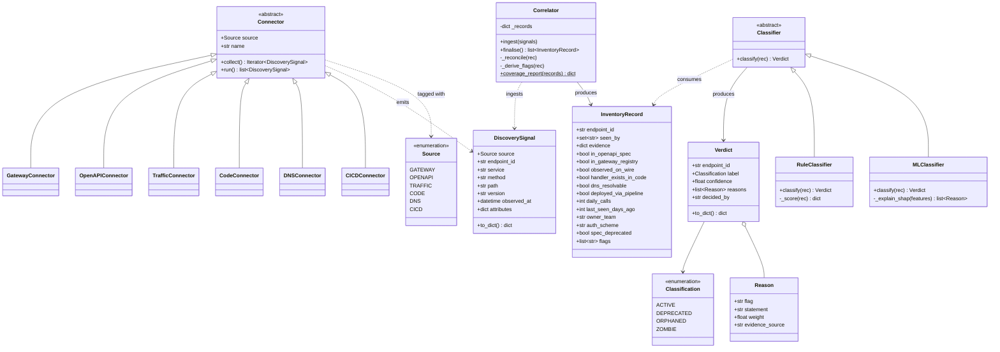
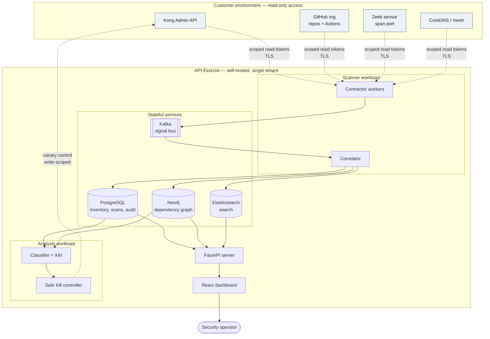
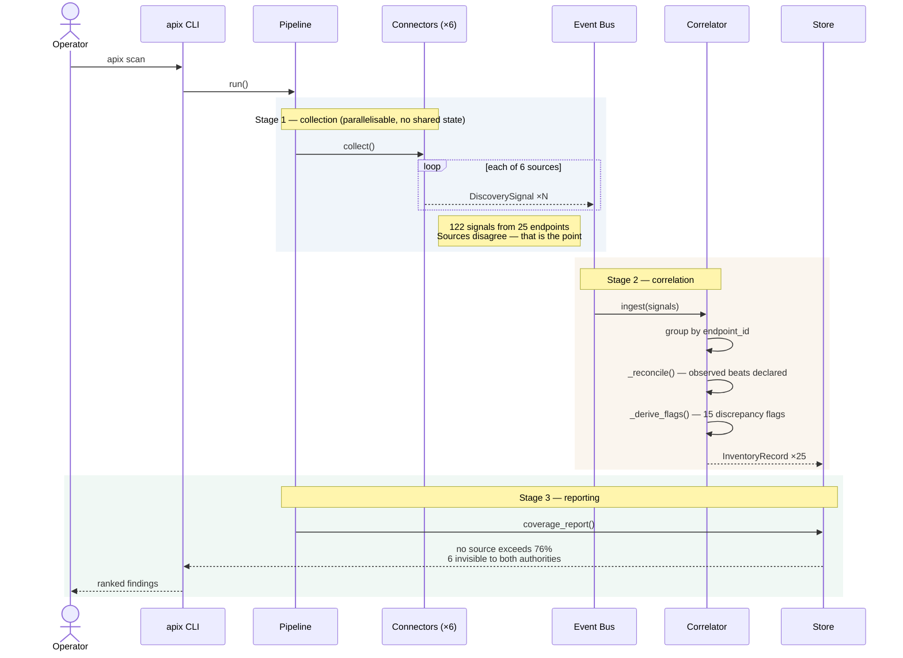
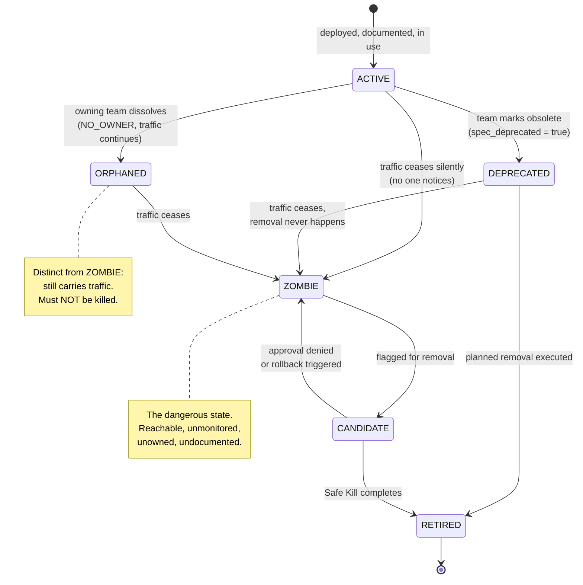
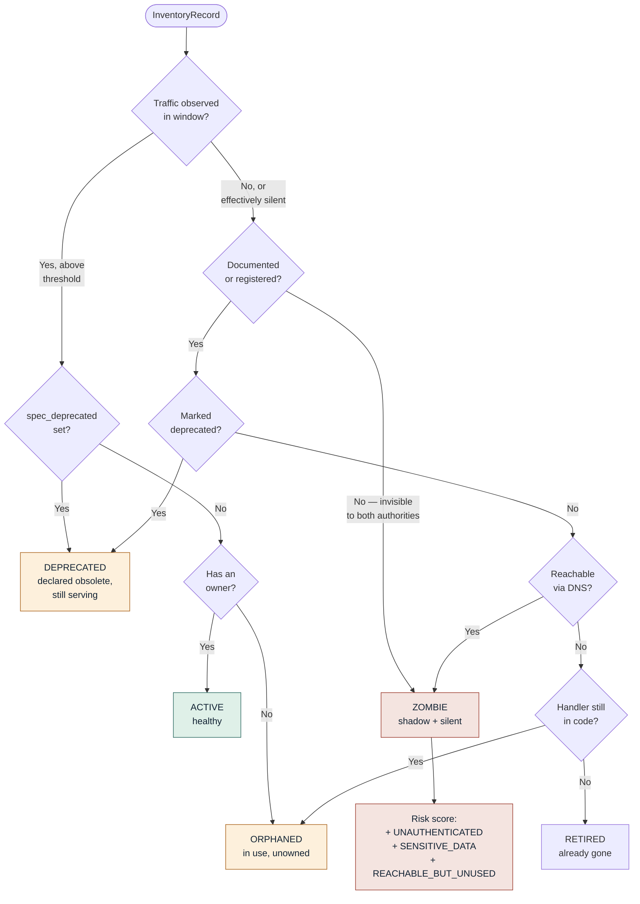
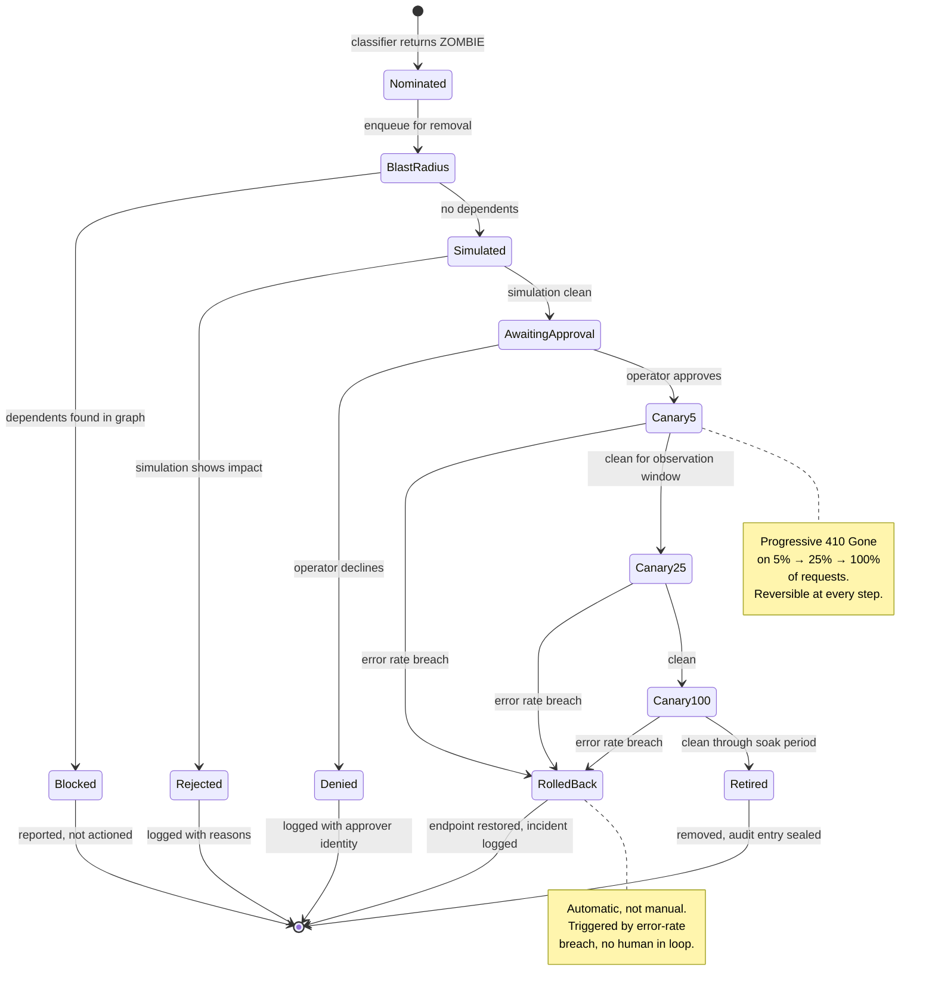
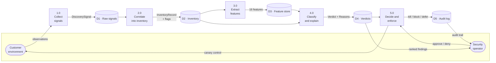
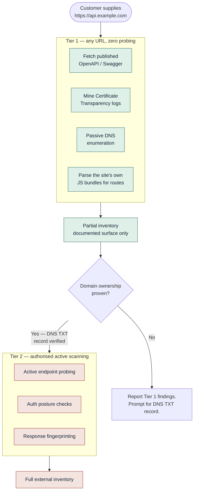

# Design Document

**API Exorcist — autonomous discovery and safe elimination of zombie, shadow and orphaned APIs**

B.Tech CSE (Cyber Security), MPSTME, NMIMS · 2026–2027

> **Status key used throughout.** ✅ implemented and tested · 🔵 in progress ·
> ⬜ designed, not yet built. The distinction is stated on every diagram, because a
> design document that hides which parts are real is worthless as an engineering
> artefact.

---

## 1. Design principles

Five principles constrain every decision that follows. They are listed first because
each later choice is traceable to one of them.

| # | Principle | Consequence |
|---|---|---|
| P1 | **No source is trusted alone.** Every connector is a partial, imperfect witness. | Six connectors; disagreement between them is treated as signal, not noise. |
| P2 | **Absence is evidence.** A zombie is identified by what *fails* to see it. | The inventory records which sources did *not* observe each endpoint. |
| P3 | **Observed beats declared.** What happened on the wire outranks what a config claims. | `_reconcile()` prefers traffic-observed auth over gateway-declared auth. |
| P4 | **Every verdict carries its reasons.** | Classification returns a `Verdict` with an evidence set, never a bare label. |
| P5 | **Nothing is destroyed without a reversible path.** | Safe Kill is canary-and-rollback, never immediate deletion. |

P1 and P2 come from the dead-code and architecture-recovery literature [1][3]; P4 from
the explainability literature [8][9]; P5 is a requirement of the regulated deployment
target rather than a research finding.

---

## 2. Structural view

### 2.1 Component diagram — five layers



**Layer boundaries are enforced by dependency direction.** Layer 1 knows nothing of
Layer 2; connectors emit `DiscoverySignal` and never classify. Layer 3 never reaches
back to a data source. This is what makes the simulated estate swappable for live
sources without touching anything downstream — the single most important structural
property of the system.

### 2.2 Class diagram — core domain model



Implemented: `Source`, `DiscoverySignal`, `Connector` and its six subclasses,
`InventoryRecord`, `Correlator`. ✅
In progress: `Classification`, `Verdict`, `Reason`, `Classifier`, `RuleClassifier`. 🔵
Designed: `MLClassifier`. ⬜

**Why `Verdict` composes `Reason` rather than carrying a string.** P4 requires that
every decision be auditable. A `list[Reason]`, each naming the flag, a
human-readable statement, its weight, and the source that observed it, serialises
directly into the audit log and renders directly in the dashboard. A formatted string
would have to be parsed back apart for either purpose.

### 2.3 Deployment diagram



**The only write path into the customer's environment is the Safe Kill controller's
canary control, and it holds a separate, write-scoped credential from the read tokens
used for discovery.** A compromise of the scanner cannot disable an endpoint. This
separation is a hard requirement of the banking deployment target.

---

## 3. Behavioural view

### 3.1 Sequence diagram — a discovery scan ✅



### 3.2 State machine — endpoint lifecycle

This is the taxonomy the project is named for, expressed as states rather than a
static quadrant. Transitions are what the classifier detects.



**The `ORPHANED → ZOMBIE` distinction is the one that matters operationally.** An
orphaned endpoint has no owner but real users; killing it causes an outage. A zombie
has neither. Conflating them is the failure mode that would make this product
dangerous, which is why they are separate classes rather than a single "abandoned"
label.

### 3.3 Classification decision logic 🔵



**Implementation note — the tree became additive scoring.** The diagram above is the
*semantics* of the four classes and remains accurate as a description of intent. The
implementation in `engine/rules.py` realises it as fourteen evidence rules, each with
a signed weight per class; the highest total wins. Three reasons drove the change, all
discovered while building:

1. **A tree commits at its first branch.** Real evidence conflicts — an endpoint can be
   documented, owned, *and* completely silent. Scoring weighs the conflict; a tree lets
   whichever test happens to run first decide.
2. **Confidence falls out of the margin.** A tree yields a label with no native measure
   of how close the call was. The gap between the top two scores is exactly the signal
   needed to decide when to consult the ML layer.
3. **It matches the shape of SHAP.** SHAP explains a prediction as additive feature
   contributions. This layer explains a verdict as additive evidence contributions.
   Both layers therefore emit the same explanation structure, and the dashboard and
   audit log need one renderer rather than two.

Determinism and auditability are unchanged, and the weights were fixed from the class
definitions *before* accuracy was measured — not tuned against the answer key
afterwards, which would make the reported figures meaningless.

The ML layer runs alongside and is consulted only where the margin is narrow. **Rules
decide; the model advises.** That ordering keeps the system explainable by
construction rather than by post-hoc attribution.

### 3.3.1 Measured performance ✅

Against the 25-endpoint estate, all four sources correlated:

| Class | Precision | Recall | F1 | Support |
|---|---|---|---|---|
| ACTIVE | 0.923 | 1.000 | 0.960 | 12 |
| DEPRECATED | 1.000 | 0.667 | 0.800 | 3 |
| ORPHANED | 1.000 | 1.000 | 1.000 | 2 |
| ZOMBIE | 1.000 | 1.000 | 1.000 | 8 |
| **macro avg** | **0.981** | **0.917** | **0.940** | 25 |

Accuracy 0.960 (24/25). **Zombie recall is 1.000 and no live endpoint was marked for
removal** — the two properties that matter operationally, since a missed zombie is an
unremediated exposure and a false zombie is an outage.

**The single error is instructive and is not a tuning problem.**
`POST /v1/kyc/aadhaar/ekyc` is genuinely DEPRECATED but was classified ACTIVE. It is
the one deprecated endpoint in the estate whose team never set the OpenAPI
`deprecated` flag — precisely the behaviour Cassieri et al. [2] documented. Every
*observable* property of that endpoint is identical to a healthy one: documented,
registered, owned, carrying traffic.

Note the confidence: **0.803, the same as correctly-classified ACTIVE endpoints.** The
classifier is not hesitant here — it is confidently wrong, because the evidence
genuinely does not distinguish the two cases. No amount of model sophistication
resolves this; only a new signal would, such as `CODEOWNERS`, a changelog, or a pull
request referencing the migration. **That is a finding about the limits of
observation, and it belongs in the paper as one.**

### 3.4 State machine — Safe Kill Simulation ⬜

The centrepiece of the remediation half, and the project's actual research
contribution.



**Every terminal state writes to the audit log, including the failures.** `Blocked`,
`Rejected` and `Denied` are recorded with the same rigour as `Retired`, because an
auditor asking "why was this endpoint *not* removed" needs an answer as much as the
reverse. This is a compliance requirement under the RBI framework, not a
nice-to-have.

### 3.5 Data flow diagram — level 1 ✅🔵



---

## 4. Data model

### 4.1 The sixteen observable features

Every feature answers: *what real-world observation produces this?* If the answer were
"the ground-truth label," it would not be a feature. A test enforces this.

| Feature | Type | Observed by | Rationale |
|---|---|---|---|
| `in_openapi_spec` | bool | OPENAPI | Documentation presence |
| `in_gateway_registry` | bool | GATEWAY | Registration presence |
| `observed_on_wire` | bool | TRAFFIC | Any real usage |
| `handler_exists_in_code` | bool | CODE | Implementation presence |
| `dns_resolvable` | bool | DNS | Reachability — the danger multiplier |
| `deployed_via_pipeline` | bool | CICD | Deployment provenance |
| `daily_calls` | int | TRAFFIC | Usage intensity |
| `last_seen_days_ago` | int | TRAFFIC | Recency of use |
| `distinct_callers` | int | TRAFFIC | Breadth of dependence |
| `days_since_last_commit` | int | CODE | Maintenance recency [1] |
| `spec_deprecated` | bool | OPENAPI | Declared lifecycle state [2] |
| `has_owner` | bool | OPENAPI, CICD | Accountability |
| `auth_is_none` | bool | TRAFFIC, GATEWAY | Security posture |
| `auth_is_legacy` | bool | TRAFFIC, GATEWAY | Weak posture |
| `is_sensitive_data` | bool | OPENAPI | Blast severity |
| `source_count` | int | derived | How many witnesses agree |

`source_count` is the operationalisation of P2: a low count with a live `dns_resolvable`
is the zombie signature.

### 4.2 The fifteen discrepancy flags ✅

Grouped by the security-smell category they instantiate [6][7].

| Group | Flags |
|---|---|
| Documentation gap | `UNDOCUMENTED`, `UNREGISTERED`, `SHADOW_CANDIDATE` |
| Usage gap | `NO_TRAFFIC_IN_WINDOW`, `EFFECTIVELY_SILENT`, `STALE_6M` |
| Ownership gap | `NO_OWNER` |
| Reachability | `REACHABLE_BUT_UNUSED` |
| Security posture | `UNAUTHENTICATED`, `LEGACY_AUTH`, `SENSITIVE_DATA` |
| Lifecycle | `MARKED_DEPRECATED`, `CODE_UNTOUCHED_1Y` |
| Provenance | `NO_PIPELINE_RECORD` |

---

## 5. Interface design — the two-tier URL scanner ⬜

A customer may onboard by connecting a repository or by supplying a URL. The URL path
is deliberately tiered, for the reasons established in [10].



**Tier 1 makes no request to any customer endpoint.** It reads published
specifications, public CT logs, public DNS, and the customer's own served JavaScript.
Tier 2 unlocks only after a DNS TXT record proves domain control — the same pattern
used by Google Search Console and by commercial attack-surface platforms.

This is a design constraint, not a limitation to apologise for. Probing endpoints on
infrastructure one does not control is unauthorised access; against a bank it is a
criminal matter. A product that shipped without this gate could not be sold.

---

## 6. Traceability — requirements to design

| Requirement | Origin | Addressed by |
|---|---|---|
| Identify a dataset for the ML engine | Jury review | §4.1, synthetic labelled estate; `dataset/build.py` ✅ |
| Use explainable AI | Jury review | §2.2 `Verdict`/`Reason`; §3.3 rules-first; SHAP for the model layer 🔵 |
| Comparative before/after study | Jury review | §7 benchmark: single-source baseline vs. correlated full pipeline 🔵 |
| Focus on one application | Jury review | Simulated retail-banking mesh, 6 services, 25 endpoints ✅ |
| Enhance the engine section of the paper | Jury review | Written last, from measured results (Phase 9) ⬜ |
| Scan via GitHub repository | Product | Real Semgrep `CodeConnector` (Phase 1) ⬜ |
| Scan via URL | Product | §5 two-tier scanner ⬜ |
| Shippable, self-hosted | Product | §2.3 deployment; credential separation ⬜ |

---

## 7. The comparative evaluation design 🔵

The before/after paper requires a measurable baseline built into the product, not
assembled afterwards.

**Baseline mode** answers: *what would a conventional single-source approach have
found?* It runs the same estate through one authoritative source alone — the gateway
registry, as a bank would today.

**Full mode** runs the complete six-source correlated pipeline.

### 7.1 Measured results ✅

Produced by `python -m evaluation.benchmark`, which writes `data/benchmark.json`.

| Configuration | Estate coverage | Zombies caught | Zombie recall |
|---|---|---|---|
| Gateway registry only | 19 / 25 (76.0%) | 2 / 8 | 25.0% |
| OpenAPI specification only | 17 / 25 (68.0%) | 0 / 8 | 0.0% |
| Gateway + specification (conventional) | 19 / 25 (76.0%) | 2 / 8 | 25.0% |
| **API Exorcist — six sources, correlated** | **25 / 25 (100%)** | **8 / 8** | **100.0%** |

**End-to-end zombie recall is the headline metric**, not raw discovery coverage. It
counts an endpoint only if the configuration both *discovered* and *correctly
classified* it, because an organisation cannot remediate an endpoint it never knew
existed. A configuration that finds an endpoint and calls it healthy has not helped.

The six zombies a conventional inventory misses entirely are:

```
GET  /v1/kyc/documents/{id}/raw        unauthenticated, raw identity documents
GET  /v1/cards/{id}/pin                abandoned PIN-retrieval design
POST /v1/debug/payments/replay         unauthenticated payment replay
POST /v1/internal/accounts/reindex     2022 migration leftover
POST /v1/loans/scorecard/experiment    concluded A/B experiment
GET  /v1/notify/templates/preview      retired internal CMS tool
```

**Four of the eight carry no authentication at all.** Note that the OpenAPI-only
configuration scores 0% — documentation, on its own, is worse than useless for this
problem, because the endpoints that matter are precisely the ones nobody documented.

That every configuration runs identical pipeline code with only the connector set
varying is what makes this a controlled comparison rather than a marketing claim.

---

## 8. Known design limitations

Stated here rather than discovered by a reviewer.

1. **Ownership is unobservable for fully-shadow endpoints.** An endpoint absent from
   both the spec and CI/CD has no observable owner, so a `ZOMBIE` with a living owner
   is indistinguishable from an `ORPHANED` one on that feature alone. Mitigation:
   repository `CODEOWNERS` as a seventh signal.
2. **The estate is small.** 25 endpoints proves correlation works; it cannot
   cross-validate a model. Mitigation: parameterised generation of many estates.
3. **The traffic window is fixed at 30 days.** A genuinely quarterly batch endpoint
   looks silent. Mitigation is deliberately *not* in discovery — it is the Safe Kill
   approval gate, because the correct response to seasonal ambiguity is a human
   decision, not a smarter threshold.
4. **The estate is synthetic.** The defensible claim is that the engine recovers known
   decay patterns from partial, disagreeing evidence — never that it is validated on
   production bank data. No public zombie-API corpus exists, because a real API
   inventory is a map of an attack surface.

---

## 9. References

Full citations in [`literature-review.md`](literature-review.md) §11. Numbering matches.

[1] Caivano et al., EMSE 2023 · [2] Cassieri et al., PROFES 2023 ·
[3] Bushong et al., ASE 2021 · [4] Ma et al., FGCS 2019 ·
[5] Abdelfattah & Cerný, ESOCC 2023 · [6] Dell'Immagine et al., Future Internet 2023 ·
[7] Ponce et al., CLEIej 2024 · [8] Lundberg & Lee, NIPS 2017 ·
[9] Gaspar et al., IEEE Access 2024 · [10] Scheitle et al., IMC 2018
